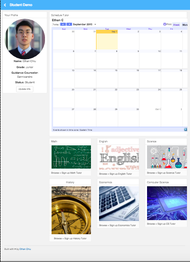

# StudyTogether
<i>Learn with other Wellesley High School Students</i>

</img>
 
<i>Desktop Home Page</i>
 
</img>
 
<i>Mobile Login Welcome Page (Student)</i>
 
</img>
 
<i>Mobile Login Welcome Page (Tutor)</i>
 

  
Entered in Codecademy Summer of Code => https://www.reddit.com/r/Codecademy/comments/3iqew2/summer_of_code_submission_thread/culnu3y

<b>Future Additions</b>
<ul>Video Tutoring</ul>
<ul>Teacher Office Hour integration</ul>
<ul>Full Mobile Capabilities</ul>
<ul>Fully Developed Backend</ul>

